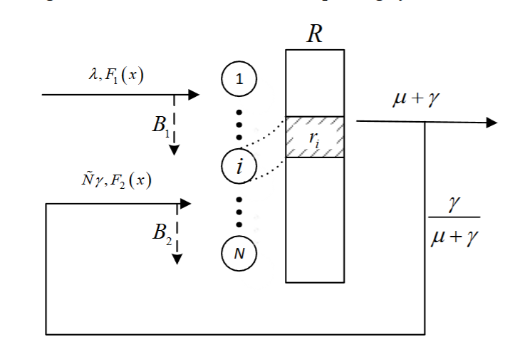
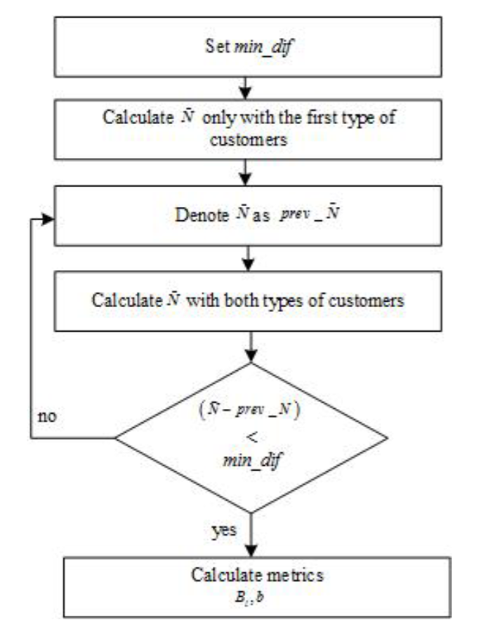
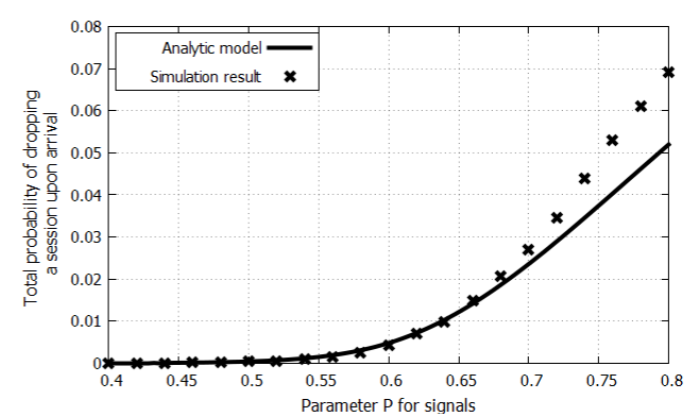
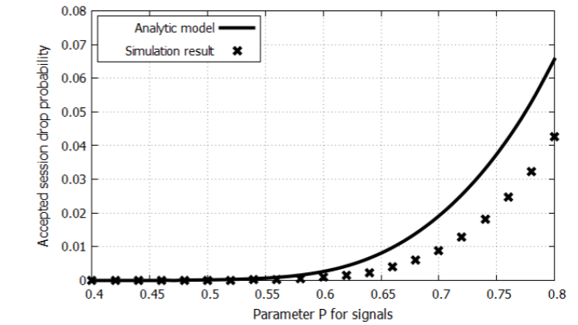
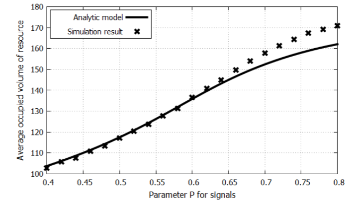

# ПРИБЛИЖЕННЫЙ АНАЛИЗ СИСТЕМЫ МАССОВОГО ОБСЛУЖИВАНИЯ С ОГРАНИЧЕННЫМИ РЕСУРСАМИ И СИГНАЛАМИ  
**Эдуард Сопин*, Кирилл Агеев*, Константин Самуйлов*†**

* Российский университет дружбы народов (РУДН)  
Кафедра прикладной информатики и теории вероятностей  
ул. Миклухо-Маклая, 6, Москва, 117198, Российская Федерация  
{sopin-es, ageev-ka, samuylov-ke}@rudn.ru

† Институт проблем информатики †,  
Федеральный исследовательский центр  
«Информатика и управление»  
ул. Вавилова, Москва, 119333, Российская Федерация

## Ключевые слова

Система массового обслуживания, ограниченные ресурсы, случайные требования, анализ производительности, имитационное моделирование.

## Аннотация

Системы массового обслуживания с ограниченными ресурсами, в которых заявки в течение обслуживания требуют не только устройство, но и некоторый объём ограниченного ресурса, доказали свою эффективность при анализе производительности современных беспроводных сетей. Однако использование таких систем массового обслуживания приводит к сложным вычислениям. В данной работе предлагается метод приближённого анализа систем массового обслуживания с ограниченными ресурсами и сигналами, которые инициируют перераспределение ресурсов заявок. Результаты приближённого анализа сравниваются с результатами имитационного моделирования исходной модели.

## I. Введение

Системы массового обслуживания с ограниченными ресурсами и сигналами могут использоваться для анализа производительности современных беспроводных сетей [1, 2]. Поступление сигнала означает, что заявке требуется иной объём ресурсов. При поступлении сигнала заявка покидает систему и немедленно возвращается в неё снова, но уже с новыми требованиями к ресурсам.

Аналитические вычисления вероятностных характеристик ресурсной системы массового обслуживания с сигналами в случае пуассоновского входного потока представлены в [3, 4, 5]. Применение таких аналитических формул для вычисления стационарных характеристик оказывается довольно сложным, поскольку требует вычисления множественных свёрток функции распределения требований к ресурсам, и с увеличением размерности системы время вычислений также возрастает.

Аналитические вычисления для таких систем требуют значительных вычислительных ресурсов, поэтому в [6, 7] нами был разработан инструмент имитационного моделирования систем массового обслуживания с ограниченными ресурсами и сигналами.

Использование средств имитационного моделирования позволило уменьшить нагрузку на вычислительные ресурсы при расчётах вероятностно-временных характеристик.

В данной работе предлагается рассмотреть приближённый метод вычисления стационарных характеристик модели. Кроме того, проводится сравнение точности вычислений с методами, предложенными в [3, 4].

Остальная часть статьи организована следующим образом. В разделе II кратко описывается система массового обслуживания с ограниченными ресурсами и сигналами, в разделе III — приближённый метод анализа рассматриваемой модели. В разделе IV выполняется численная оценка приближённого метода, а результаты сравниваются с имитационным моделированием. Раздел V содержит выводы.

## II. Система массового обслуживания с сигналами

Рассмотрим многоканальную систему массового обслуживания с N обслуживающими приборами, в которую поступающая заявка занимает не только один прибор, но и некоторый объём ограниченного ресурса. Общий объём ресурса в системе равен R, а объёмы ресурсов, требуемых заявками, являются независимыми одинаково распределёнными случайными величинами с функцией распределения F₁(x). Далее предполагается, что ресурсы дискретны. В случае непрерывных требований к ресурсам можно использовать алгоритм упрощения, описанный в [5].

Заявки поступают согласно пуассоновскому процессу с интенсивностью λ, а времена обслуживания имеют экспоненциальное распределение с параметром μ. Каждая заявка в системе порождает поток сигналов. Сигналы поступают согласно пуассоновскому процессу с интенсивностью γ. Когда поступает сигнал, заявка освобождает прибор и занятые ресурсы, а затем снова поступает в систему с новыми требованиями к ресурсам, имеющими функцию распределения F₂(x). Следовательно, заявки покидают систему с интенсивностью μ + γ и возвращаются обратно с вероятностью γ/(μ + γ).

Пусть $\xi(t)$ — число заявок в системе в момент времени $t > 0$, а $\gamma(t) = (\gamma_1(t), \ldots, \gamma_{\xi(t)}(t))$ — вектор занятых ресурсов каждой заявкой. Если $\xi(t) = 0$, то вектор $\gamma(t)$ пуст. Поведение системы описывается стохастическим процессом $X(t) = (\xi(t), \gamma(t))$ на множестве состояний  

$$
S = \{(n, r_1, \ldots, r_n): 0 \le n \le N, r_i \ge 0, \sum_{i=1}^n r_i \le R\}.
$$

На рисунке 1 показана схема системы массового обслуживания.

**Рисунок 1. Схема ресурсной системы массового обслуживания**

В работе [4] для этой системы были получены система уравнений равновесия и стационарные вероятности с использованием матрично-геометрических методов. С увеличением пространства состояний растёт и размерность матрицы генератора, из-за чего вычисления в системах реального масштаба становятся слишком сложными. В следующем разделе мы пытаемся решить эту проблему с помощью приближённого метода.

## III. Предположение для приближённого анализа

Предположим, что заявки, повторно поступающие после сигнала, образуют новый тип заявок с интенсивностью $\tilde{N}\gamma$, где $\tilde{N}$ — среднее число заявок в системе. Обозначим $L = 2$ как множество типов заявок.

Предположим, что требования к ресурсам не зависят от процессов поступления и обслуживания.

Обозначим через $p_{l_k, r_k}$ вероятность того, что $k$-я заявка типа $l$ потребует $r_{l_k}$ ресурсов, а через $p_{l, r_i}$ — вероятность того, что заявка типа $l$ потребует $r_l$ ресурсов. Тогда $p_{l,r_l}^{(k_l)}$ — вероятность того, что $k_l$ заявок типа $l$ потребуют $r_l$, где $p_{l,r_l}^{(k_l)}$ является $k$-кратной свёрткой вероятностей $p_{l,r_l}$.

Обозначим $\rho_1 = \lambda/(\mu + \gamma)$ — предложенную нагрузку для заявок первого типа, и $\rho_2 = \tilde{N}\gamma/(\mu + \gamma)$ — предложенную нагрузку для заявок второго типа. Согласно [5], можно объединить предложенные нагрузки:

$$
p_r = \sum_{l=1}^L \frac{\rho_l}{\rho} p_{l,r_l},
$$

где $\rho = \sum_{l=1}^L \rho_l$, и вычислить стационарные вероятности следующим образом:

$$
q_{k,r} = q_0 \cdot \frac{\rho^k}{k!} \cdot p_r^{(k)} \tag{1}
$$

где $p_r^{(k)}$ — $k$-кратная свёртка вероятностей $p_r$.

$$
q_0 = \left( \sum_{k=0}^N \sum_{j=0}^R \frac{\rho^k}{k!} p_j^{(k)} \right)^{-1}. \tag{2}
$$

Формула (2) задаёт нормировочную константу $G(n, r)$. В работе [5] мы разработали рекуррентный алгоритм для вычисления этой нормировочной константы:

$$
G(n, r) = G(n-1, r) + \frac{\rho}{n} \sum_{i=0}^r p_i \bigl( G(n-1, r-i) - G(n-2, r-i) \bigr), \quad 2 \le n \le N \tag{3}
$$

с начальными значениями:

$$
G(1, r) = 1 + \rho \sum_{j=0}^r p_j, \quad 0 \le r \le R. \tag{4}
$$

Также в [5], имея нормировочную константу $G(n, r)$, мы вывели формулы для вероятности блокировки $B$, среднего числа занятых ресурсов $b$, а также вероятности блокировки заявок типа $l$, обозначенной $B_l$:

$$
B = 1 - G^{-1}(N, R) \sum_{j=0}^R p_j G(N-1, R-j). \tag{5}
$$

$$
B_l = 1 - G^{-1}(N, R) \sum_{n=0}^{N-1} \frac{\rho^n}{n!} \sum_{j=0}^R \sum_{i=0}^j p_{l,i} p_{j-i}^{(n)} = 1 - G^{-1}(N, R) \sum_{j=0}^R p_{l,j} G(N-1, R-j). \tag{6}
$$

$$
b = R - G(N, R)^{-1} \sum_{j=1}^R G(N, R-j). \tag{7}
$$

В нашей модели предложенная нагрузка для заявок второго типа зависит от $\tilde{N}$, поэтому её можно вычислить по формуле ниже, снова используя нормировочную константу:

$$
\begin{aligned}
\tilde{N} &= \sum_{n=1}^N \sum_{r=0}^R n q_{n,r} \\
&= q_0 \sum_{n=1}^N n \frac{\rho^n}{n!} \sum_{r=0}^R p_r^{(n)} \\
&= q_0 \rho \sum_{n=1}^N \frac{\rho^{n-1}}{(n-1)!} \sum_{r=0}^R p_r^{(n)} \\
&= q_0 \rho \sum_{n=0}^{N-1} \frac{\rho^n}{n!} \sum_{r=0}^R p_r^{(n+1)} \\
&= q_0 \rho \sum_{n=0}^{N-1} \frac{\rho^n}{n!} \sum_{r=0}^R \sum_{j=0}^r p_j p_{r-j}^{(n)} \\
&= q_0 \rho \sum_{n=0}^{N-1} \frac{\rho^n}{n!} \sum_{j=0}^R p_j \sum_{r=j}^R p_{r-j}^{(n)} \\
&= q_0 \rho \sum_{j=0}^R p_j \sum_{n=0}^{N-1} \frac{\rho^n}{n!} \sum_{r=0}^{R-j} p_r^{(n)} \\
&= q_0 \rho \sum_{j=0}^R p_j G(N-1, R-j). \tag{8}
\end{aligned}
$$

На рисунке 2 показан алгоритм приближённого вычисления характеристик производительности. Перед началом необходимо задать $min\_dif$ — порог точности для среднего числа заявок $\tilde{N}$. В начале приближённого расчёта рассматриваются только заявки первого типа. Вычисляется $\tilde{N}$ для заявок первого типа и обозначается как $\tilde{N}_{\text{prev}}$. Имея $\tilde{N}$, можно вычислить входные параметры для заявок второго типа и затем вычислить $\tilde{N}$ уже для двух потоков заявок с интенсивностями $\lambda$ и $\tilde{N}_{\text{prev}} \gamma$.

На следующем шаге разность между $\tilde{N}$ и $\tilde{N}_{\text{prev}}$ сравнивается с порогом точности $min\_dif$. Если разность меньше $min\_dif$, вычисляются вероятность блокировки вновь поступающих заявок $B_1$, вероятность блокировки заявок второго типа $B_2$ и средний объём занятых ресурсов $b$. Иначе выполняется возврат к вычислению $\tilde{N}$ с новой интенсивностью второго потока.

**Рисунок 2. Блок-схема алгоритма приближённого расчёта**

Заметим, что вероятность блокировки заявок второго типа можно интерпретировать как вероятность того, что поступление сигнала приводит к потере заявки. Однако в большинстве практических случаев вместо этого требуется вероятность $B_3$, что заявка будет завершена до корректного окончания обслуживания:

$$
B_3 = \frac{\gamma \tilde{N} B_2}{\lambda (1 - B_1)}. \tag{9}
$$

## IV. Результаты приближённого анализа

В этом разделе мы сравниваем результаты приближённого метода с результатами имитационного моделирования. Положим число устройств N = 100, число ресурсов R = 200, а интенсивности равными λ = 50, μ = 1, γ = 5. Для требований к ресурсам использовалось геометрическое распределение с параметром P_l для каждого типа заявок: P₁ = 0.75 для вновь поступающих заявок и P₂ ∈ [0.4; 0.8] для вторичных заявок.

Результаты моделирования сравнивались с вычислениями по формулам (5)–(7), где характеристики системы массового обслуживания получались с использованием геометрической функции распределения и формул (5)–(7) для дискретных требований к ресурсам (рисунки 3, 4, 5).

Можно заметить, что разность между аналитическими и имитационными результатами увеличивается с ростом среднего объёма требуемых ресурсов после поступления сигнала. Основная проблема связана со способом генерации сигналов. Если в исходной модели при поступлении сигнала заявка освобождает занятые ресурсы и один прибор, то этот процесс гарантирует наличие некоторого свободного объёма ресурса и одного прибора для данной заявки, поскольку она возвращается немедленно с новыми требованиями к ресурсам. Но в нашей приближённой модели заявки второго типа могут не увидеть свободных ресурсов при поступлении. Поэтому приближённый подход даёт верхнюю границу для вероятности блокировки принятых заявок.

**Рисунок 3. Вероятность блокировки новых заявок**  

**Рисунок 4. Вероятность блокировки принятых заявок**  

**Рисунок 5. Средний занятый объём ресурсов**

## V. Заключение

В статье описан приближённый подход к анализу стационарных характеристик системы массового обслуживания с ограниченными ресурсами и сигналами. Этот метод может использоваться для оценки характеристик производительности современных беспроводных сетей.

В дальнейшей работе планируется реализовать более точный анализ аналитической модели с сигналами.

## Благодарности

Публикация подготовлена при поддержке программы «РУДН 5-100» и профинансирована РФФИ в соответствии с исследовательскими проектами № 18-07-00576, 19-07-00933.

## Литература

[1] Lu X., Sopin E., Petrov V., Galinina O., Moltchanov D., Ageev K., Andreev S., Koucheryavy Y., Samouylov K., Dohler M. *Integrated Use of Licensed-and Unlicensed-Band mmWave Radio Technology in 5G and Beyond*. IEEE Access, preprint.

[2] Galinina O., Andreev S., Turlikov A., Koucheryavy Y. *Optimizing Energy Efficiency of a Multi-Radio Mobile Device in Heterogeneous Beyond-4G Networks*, Performance Evaluation, vol. 78, 2014, pp. 18–41.

[3] Tikhonenko O. *Generalized Erlang problem for service systems with finite total capacity*. Problems of Information Transmission, 41(3), 2005, pp. 243–253.

[4] Sopin E., Vikhrova O., Samouylov K. *LTE network model with signals and random resource requirements*, Proc. of 9th International Congress on Ultra Modern Telecommunications and Control Systems and Workshops (ICUMT), 2017, pp. 101–106.

[5] Sopin E.S., Ageev K.A., Markova E.V., Vikhrova O.G., Gaidamaka Yu.V. *Performance Analysis of M2M Traffic in LTE Network Using Queuing Systems with Random Resource Requirements*, Automatic Control and Computer Sciences, 2018, vol. 52, no. 5, pp. 345–353.

[6] Eduard Sopin, Kirill Ageev, Sergey Shorgin. *Simulation Of The Limited Resources Queuing System For Performance Analysis Of Wireless Networks*, Proceedings of the 32nd European Conference on Modelling and Simulation, 2018, pp. 505–509.

[7] Eduard Sopin, Kirill Ageev. *Simulation Of The Limited Resources Queuing System Include Signal Event For Performance Analysis Of Wireless Networks*, Proceedings of the 10th International Congress on Ultra Modern Telecommunications And Control Systems, 2018.

## Сведения об авторах

**ЭДУАРД СОПИН** получил степени бакалавра и магистра по прикладной математике в Российском университете дружбы народов (РУДН) в 2008 и 2010 годах соответственно. В 2013 году получил степень кандидата наук по прикладной математике и информатике. С 2009 года работает в РУДН, в настоящее время — доцент кафедры прикладной информатики и теории вероятностей. Его научные интересы связаны с анализом производительности современных беспроводных сетей и облачных/туманных вычислений. Электронная почта: sopin-es@rudn.ru.

**КОНСТАНТИН САМУЙЛОВ** получил степень PhD в МГУ и степень доктора наук в Московском техническом университете связи и информатики. С 2014 года он является заведующим кафедрой прикладной информатики и теории вероятностей РУДН. Автор более 150 научно-технических публикаций и трёх книг. Его научные интересы включают анализ производительности сетей 4G (LTE и WiMAX), телетрафик сетей triple play, планирование сигнализации и облачные вычисления.

**КИРИЛЛ АГЕЕВ** родился в Актобе, Казахстан, обучался в Российском университете дружбы народов, где получил степень в области компьютерных наук в 2017 году. В настоящее время является аспирантом кафедры телекоммуникаций и информатики. Электронная почта: ageev-ka@rudn.ru.
